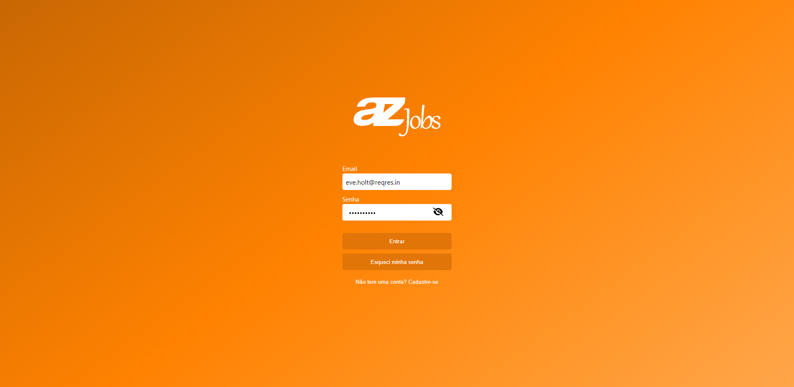
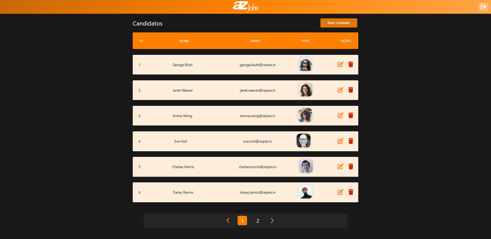
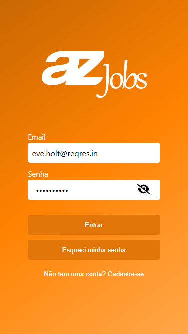
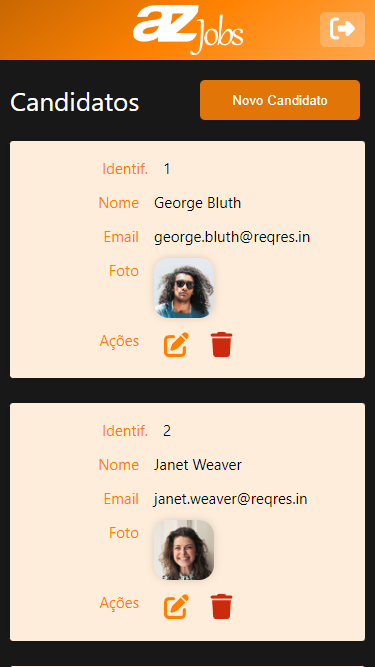

# AZ Jobs - Sistema de Cadastro de Candidatos Interessados para Vagas de Emprego


<br/>
<a href="https://azjobs.vercel.app"></a>

Obrigado a toda equipe da **AZ Tecnologia** pela oportunidade de demonstrar meus conhecimentos.

Este repositório contém o código-fonte de um sistema de cadastro de candidatos para vagas de emprego. O sistema foi desenvolvido utilizando a linguagem de programação JavaScript e o framework Vue.js para a construção da interface web.

O objetivo do sistema é facilitar e organizar o processo de seleção de candidatos para vagas de emprego. Ele permite que os recrutadores criem e gerenciem os candidatos.

## Funcionalidades

- Criação de conta;
- Cadastro, edição, exclusão e listagem de candidatos;

## Pré-requisitos do projeto

Antes de executar o sistema, é necessário ter instalado os seguintes softwares:

- Node 12.x ou mais recente
- Vue.js

## Executando o Sistema

Para executar o sistema, siga os seguintes passos:

1. Clone o repositório para a sua máquina local:

   ```
   git clone https://github.com/victormaitan/teste-aztecnologia.git
   ```

2. Acesse o diretório do projeto:

   ```
   cd teste-aztecnologia
   ```

3. Instale as dependências do projeto:

   ```
   npm install
   ```

4. Execute o script de inicialização:

   ```
   npm run dev
   ```

5. Acesse o sistema em um navegador web:

   ```
   http://127.0.0.1:5173/
   ```
<br/>

# **Desafio**:

## Persona
Karen é responsável por contratar novos funcionários para a empresa onde
trabalha. Ela utiliza o email para receber os dados solicitados aos candidatos interessados na vaga.
<br/>

## Problema
Karen precisa analisar todos os dados enviados pelos candidatos, para isso ela entra em todos os emails e faz a devida análise.

O problema é que Karen recebe muitos emails além dos enviados pelos candidatos e isso deixa sua caixa de entrada bastante desorganizada. Agora ela precisa ficar pesquisando na sua conta todos os emails que possuem o assunto “Vaga”.

Temos os serviços necessários para resolver inicialmente o problema, agora
precisamos de você para criar a interface do sistema.
<br/>


## O que você deverá fazer:

Criar uma interface onde Karen possa criar, listar, editar e deletar as informações dos candidatos interessados nas vagas.

## :pencil: Requisitos

:white_check_mark: - Você pode utilizar os https://reqres.in/ para consultar os serviços necessários e atender aos requisitos<br/>
:white_check_mark: - Dê a opção de selecionar a página (paginação) <br/>
:white_check_mark: - Na exclusão, mostre um modal de confirmação, antes de excluir.<br/>
:white_check_mark: - Mostre um alert de sucesso na interface depois de executar as ações de create, update e delete <br/>
:white_check_mark: - Use o serviços de login<br/>
:white_check_mark: - Utilize o axios para consumir os serviços<br/>
:white_check_mark: - Você deverá desenvolver a interface utilizando o Vuejs.<br/>
:white_check_mark: - A interface deve ser responsiva para qualquer tela<br/>
:white_check_mark: - A estilização deve ser feita sem o uso de qualquer framework<br/>
:white_check_mark: - É desejável que utilize Vuex para armazenar o estado da paginação e o token de autenticação.<br/>
:x: - Implemente os testes unitários utilizando o Jest e o Vue Test Utils<br/>
:white_check_mark: - Utilize o npm como gerenciador de pacotes<br/>
:white_check_mark: - Disponibilize o código em um repositório no github.<br/>
:white_check_mark: - Publique o front na web, como sugestão: https://vercel.com/<br/>
 
## Screenshots

#### WEB-DESKTOP

  



  



#### WEB-MOBILE

  



  




## Agradecimentos

Gostaria de expressar minha gratidão pela oportunidade de participar do processo seletivo para DESENVOLVEDOR FRONT-END PLENO em da AZ Tecnologia. 

Foi uma experiência muito positiva e enriquecedora, onde pude aplicar meus conhecimentos, conhecer melhor a empresa e o perfil de profissional que vocês buscam.

Gostaria de agradecer também pela atenção e pelo tratamento respeitoso e profissional durante todo o processo. Fiquei muito satisfeito(a) em saber que minha candidatura foi considerada e avaliada cuidadosamente.

Independentemente do resultado, gostaria de deixar claro que estou muito feliz por ter tido a oportunidade de me candidatar e de participar deste processo seletivo. 

Agradeço novamente pela oportunidade e espero que possamos nos manter em contato em breve.

Atenciosamente,

Victor M Maitan - Engenheiro de Software e Desenvolvedor Front-end<br/>
<br/>

<br/>

## Licença

Este projeto é licenciado sob a licença MIT.